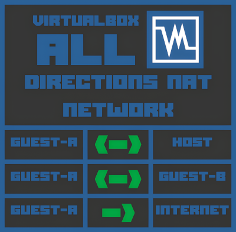

## VirtualBox - All Directions NAT Network



This is a complete guide to have the accesses "Guest-A <-> Host", "Guest-A <-> Guest-B" and "Guest-A -> Internet" on the guests **using a single network interface** ("host-only" network mode/"vboxnet0" host network interface) on VirtualBox.

In practice, what we will have is a NAT network with all accesses informed.

**WHY THIS IS STILL NEEDED:** VirtualBox still offers no built-in mode that gives you all three directions over a *single* adapter. Its "NAT Network" mode gives you "Guest -> Internet" and "Guest-A <-> Guest-B", but "Host -> Guest" only through explicit port forwarding. Its "Host-Only Adapter" mode gives you "Guest <-> Host" and "Guest-A <-> Guest-B", but never routes to the outside world - VirtualBox does not NAT a host-only network. This guide closes that gap on the host side.

Unless stated otherwise, run the commands as "root". The **`VBoxManage` commands are the exception**: run those as the regular user who owns the virtual machines, never as "root".

**NOTE:** We use a Manjaro Linux (Arch Linux based) host as a template. You may need adjustments and changes to other distros.

**NOTE:** Verified on VirtualBox 7.2. The DHCP configuration used here requires **VirtualBox 6.1 or newer**.

**IMPORTANT:** My life, my work and my passion is free software. Corrections, tweaks and improvements are very welcome (**pull requests** 😉)! Please consider giving us a ⭐, fork, support this project or even visit our professional profile (see [About](#about)). **Thanks!** 🥰

## Donations

Please consider to deposit a donation through PayPal by clicking on the next button...

[](https://www.paypal.com/donate/?hosted_button_id=TANFQFHXMZDZE)

This is free software and you are equally free to specify any amount of money you want.

**Support free software and my work!** ❤️🐧

## Table of Contents

   * [EXECUTE ON HOST](#execute-on-host)
      + [Configure IP forwarding](#configure-ip-forwarding)
      + [Configure iptables](#configure-iptables)
         - [Persist the rules](#persist-the-rules)
         - [Order the iptables service before rule-generating daemons](#order-the-iptables-service-before-rule-generating-daemons)
      + [Configure the VirtualBox DHCP server](#configure-the-virtualbox-dhcp-server)
      + [RECOMMENDED: Install and configure dnsmasq as a local DNS cache](#recommended-install-and-configure-dnsmasq-as-a-local-dns-cache)
         - [Create dnsmasq-vboxnet0.service systemd service](#create-dnsmasq-vboxnet0service-systemd-service)
         - [Configure dnsmasq-vboxnet0.service systemd service](#configure-dnsmasq-vboxnet0service-systemd-service)
         - [Adjusting the AppArmor](#adjusting-the-apparmor)
      + [Verify the host configuration](#verify-the-host-configuration)
   * [EXTRA: EXECUTE ON GUEST](#extra-execute-on-guest)
      + [Modern distros](#modern-distros)
      + [Legacy distros](#legacy-distros)
- [About](#about)

## EXECUTE ON HOST

**IMPORTANT:** The VirtualBox's "vboxnet0" host network interface should have IP (IPv4) "192.168.56.1" and subnet mask "255.255.255.0".

### Configure IP forwarding

Without this the host silently drops every packet the guests try to route through it...

```
sysctl -w net.ipv4.ip_forward=1
printf "net.ipv4.ip_forward=1\n" > /etc/sysctl.d/30-ipforward.conf
```

**NOTE:** Use `>` and not `>>`. With `>>` the file gains a duplicated line every time you run the guide.

### Configure iptables

Enable and start "iptables.service"...

```
systemctl enable --now iptables.service
```

Add the following rules. The first one makes the host masquerade (NAT) everything coming from the host-only network on its way out, which is what gives the guests "Guest-A -> Internet". The other two allow the host to actually forward that traffic...

```
iptables -t nat -A POSTROUTING -s 192.168.56.0/24 ! -o vboxnet0 -j MASQUERADE
iptables -A FORWARD -i vboxnet0 -j ACCEPT
iptables -A FORWARD -o vboxnet0 -m conntrack --ctstate RELATED,ESTABLISHED -j ACCEPT
```

**NOTE:** The `! -o vboxnet0` part keeps "Guest-A <-> Guest-B" traffic out of the NAT, so the guests always see each other's real addresses.

**NOTE:** Explicit `FORWARD` rules are used instead of `iptables -P FORWARD ACCEPT`. A permissive default policy is both weaker security and fragile: any other software on the host that manages firewall rules may reset that policy behind your back, and then the guests lose the internet with no visible cause.

#### Persist the rules

Write the rules to the file the "iptables.service" restores at boot...

```
cat > /etc/iptables/iptables.rules <<'EOF'
# vboxnet0 (VirtualBox host-only) - All Directions NAT Network
*nat
:PREROUTING ACCEPT [0:0]
:INPUT ACCEPT [0:0]
:OUTPUT ACCEPT [0:0]
:POSTROUTING ACCEPT [0:0]
-A POSTROUTING -s 192.168.56.0/24 ! -o vboxnet0 -j MASQUERADE
COMMIT
*filter
:INPUT ACCEPT [0:0]
:FORWARD ACCEPT [0:0]
:OUTPUT ACCEPT [0:0]
-A FORWARD -i vboxnet0 -j ACCEPT
-A FORWARD -o vboxnet0 -m conntrack --ctstate RELATED,ESTABLISHED -j ACCEPT
COMMIT
EOF
```

**IMPORTANT I:** Do **not** generate this file with `iptables-save > /etc/iptables/iptables.rules` while other rule-generating daemons are running. Doing so freezes the chains they created at runtime into your static file, and from then on the boot-time `iptables-restore` fights the daemons that own those chains. Write the file by hand, with your rules only, as above.

**IMPORTANT II:** Do **not** start this section by copying the empty template over your rules file (`cp /etc/iptables/empty.rules /etc/iptables/iptables.rules`). If you do that and then forget to write the rules back, the host boots with no NAT at all and the guests lose internet access with everything else looking perfectly healthy.

#### Order the iptables service before rule-generating daemons

The "iptables.service" restores whole tables, which means it **flushes** every table present in the rules file before applying it. Any rule created at runtime by another program is wiped out in the process.

This matters more than it sounds, because a lot of software installs its own "iptables" rules: container runtimes, virtualization stacks, VPN clients, security modules. They all do it **at startup only**. If "iptables.service" happens to run *after* them at boot, their rules silently disappear - and what breaks is never the firewall itself, but whatever depended on those rules, hours later, with nothing pointing back to the cause.

Ordering alone only covers **boot**, though. If you ever restart "iptables.service" by hand, the flush wipes those rules again and nothing brings them back. So the drop-in below does both things: it pins the boot order, and it puts the affected daemons back on their feet after any manual restart.

Replace `<RULE_GENERATING_DAEMON>` with each unit on your host that manages its own rules - repeat the name in `Before=` and add one `ExecStartPost` line per daemon...

```
mkdir -p /etc/systemd/system/iptables.service.d
cat > /etc/systemd/system/iptables.service.d/ordering.conf <<'EOF'
[Unit]
Before=<RULE_GENERATING_DAEMON>.service

[Service]
ExecStartPost=-/usr/bin/systemctl --no-block try-restart <RULE_GENERATING_DAEMON>.service
EOF
systemctl daemon-reload
```

**NOTE I:** Naming a unit that does not exist on the host is harmless - the leading `-` makes systemd ignore the failure.

**NOTE II:** `try-restart` restarts a unit only if it is already running, so these lines stay silent at boot, when the daemons have not started yet.

**IMPORTANT:** Restarting a daemon is not free - some of them stop the workloads they manage in the process. Weigh it per daemon. A visible restart is usually better than networking that is silently broken, but if a particular daemon is too disruptive to bounce automatically, leave it out of `ExecStartPost` and restart it by hand after every manual restart of "iptables.service".

To confirm nothing is being lost, snapshot the rules around a restart and compare - empty output means every daemon got its rules back...

```
iptables-save > /tmp/rules-before.txt
systemctl restart iptables.service
sleep 15
iptables-save > /tmp/rules-after.txt
diff <(grep -E '^(-A|-P)' /tmp/rules-before.txt | sort) <(grep -E '^(-A|-P)' /tmp/rules-after.txt | sort)
```

**NOTE I:** The `sleep` is not decoration. `--no-block` makes those restarts asynchronous, so a snapshot taken immediately catches the daemons mid-restart and reports rules as missing when they are merely late. Raise the value if your daemons are slow to come up.

**NOTE II:** The comparison filters rule lines and sorts them. Without the filter, "iptables-save" packet and byte counters produce differences on every run; without the sort, the daemons reinserting their rules in a different relative order looks like a loss when nothing was lost.

**NOTE III:** This check answers "did any rule disappear", not "is the ordering still correct". Sorting deliberately discards position, which does matter in "iptables". If you need to confirm the ordering too, compare the unsorted rule lines and read the differences yourself.

### Configure the VirtualBox DHCP server

This is what hands the guests their address, their gateway and their DNS server, so that a guest just works with no manual network setup at all.

**NOTE:** Run as your regular user, not as "root".

```
VBoxManage dhcpserver modify --network=HostInterfaceNetworking-vboxnet0 \
  --lower-ip=192.168.56.150 --upper-ip=192.168.56.254 \
  --global --set-opt=3 192.168.56.1 --set-opt=6 192.168.56.1 \
  --enable
```

DHCP option `3` is the gateway and option `6` is the DNS server, both pointing at the host's "vboxnet0" address.

**NOTE I:** If the DHCP server does not exist yet, create it first with `add` instead of `modify`, passing `--server-ip=192.168.56.100 --netmask=255.255.255.0` as well.

**NOTE II:** The range deliberately starts at ".150", leaving ".2" to ".149" free for guests you want to pin to a fixed address.

**NOTE III:** Older versions of VirtualBox had a host-only DHCP server that could not deliver the gateway and DNS options, which is why this guide used to configure "dnsmasq" as a full DHCP server, wrapped in a systemd service, a helper script and a timer to follow the interface state. Since VirtualBox 6.1 the built-in DHCP server accepts arbitrary DHCP options (`--set-opt`), so none of that is needed anymore.

To confirm what the DHCP server will hand out...

```
VBoxManage list dhcpservers
```

You should see `Enabled: Yes` and, under "Global Configuration", the options `3/legacy: 192.168.56.1` and `6/legacy: 192.168.56.1`.

### RECOMMENDED: Install and configure dnsmasq as a local DNS cache

Strictly speaking, the network already works without this section - the guests have an address, a gateway and a DNS server. What "dnsmasq" adds is a caching resolver on the host and, far more valuable, a DNS setup that does not fall apart when the host moves between networks.

**WHY THIS IS RECOMMENDED:** DHCP option `6` is a *static* address - you set it once and the guests keep using it forever. That is fine on a desktop wired to a single network. It breaks down on a laptop, because the host's own upstream resolver changes every time you move: your home router today, a hotel's tomorrow, your company's DNS while the VPN is up. Point option `6` at any of those directly and the guests lose DNS the moment you change networks. Point it at a public resolver such as `1.1.1.1` and the guests keep working everywhere - but they can no longer see the internal names behind your VPN, because a public resolver knows nothing about your company's private zones (split-DNS).

Running "dnsmasq" on the host solves both at once: `192.168.56.1` is an address that **never changes**, and "dnsmasq" follows the host's upstream on its own - it reads `/etc/resolv.conf` and picks up rewrites made by NetworkManager or by a VPN client's hook script. Connect the VPN and the guests start resolving internal names with no reconfiguration anywhere.

**IMPORTANT:** Skip this section only if the host always sits on the same network and the guests never need private DNS zones. If you do skip it, you **must** repoint DHCP option `6` at a resolver that actually answers - otherwise nothing will be listening on `192.168.56.1` and the guests get no DNS at all:

```
VBoxManage dhcpserver modify --network=HostInterfaceNetworking-vboxnet0 --global --set-opt=6 1.1.1.1
```

Install "dnsmasq"...

```
pamac install --no-confirm dnsmasq
```

We will run a dedicated instance bound to "vboxnet0", so it can coexist with a standard "dnsmasq.service" instance. For practical reasons, disable the standard one...

```
systemctl disable --now dnsmasq.service
```

**NOTE:** Leaving both enabled makes them race for port 53 at boot. Whichever loses the race stays down - and if the loser is the "vboxnet0" instance, the guests silently lose DNS.

#### Create dnsmasq-vboxnet0.service systemd service

**TIP:** The code below is a set of BASH commands that creates the file "/etc/systemd/system/dnsmasq-vboxnet0.service". The content of the cited file is contained between the delimiters "BEGIN" and "END".

```
read -r -d '' FILE_CONTENT << 'HEREDOC'
BEGIN
[Unit]
Description=dnsmasq for vboxnet0 - A lightweight DNS server for VirtualBox host-only network
Documentation=man:dnsmasq(8)
After=network.target
Before=network-online.target nss-lookup.target
Wants=nss-lookup.target

[Service]
Type=simple
ExecStartPre=/usr/bin/dnsmasq --test --conf-file=/etc/dnsmasq-vboxnet0.conf
ExecStart=/usr/bin/dnsmasq -k --user=dnsmasq --pid-file --conf-file=/etc/dnsmasq-vboxnet0.conf
ExecReload=/bin/kill -HUP $MAINPID
Restart=on-failure
PrivateDevices=true
ProtectSystem=full

[Install]
WantedBy=multi-user.target

END
HEREDOC
echo -n "${FILE_CONTENT:6:-3}" > "/etc/systemd/system/dnsmasq-vboxnet0.service"
```

#### Configure dnsmasq-vboxnet0.service systemd service

```
read -r -d '' FILE_CONTENT << 'HEREDOC'
BEGIN
# DNS cache - VirtualBox Host-only Network
# The DHCP service is provided by VirtualBox itself, so no "dhcp-range" here.
interface=vboxnet0
bind-dynamic

END
HEREDOC
echo -n "${FILE_CONTENT:6:-3}" > "/etc/dnsmasq-vboxnet0.conf"
```

**NOTE:** `bind-dynamic` instead of `bind-interfaces` is what makes this simple. With `bind-interfaces`, "dnsmasq" refuses to start when "vboxnet0" is absent and never notices it later, which is why this guide used to ship a helper script and a systemd timer polling the interface every 20 seconds. `bind-dynamic` lets "dnsmasq" follow interfaces as they come and go on its own, so the service can simply stay enabled.

Enable and start the service...

```
systemctl daemon-reload
systemctl enable --now dnsmasq-vboxnet0.service
```

#### Adjusting the AppArmor

If AppArmor is active (`aa-status`), you will need to modify its profile to allow dnsmasq access to the custom configuration file.

To adjust the AppArmor profile for "dnsmasq" to allow it access to the new configuration file...

```
sed -i '/\/etc\/dnsmasq\.conf r,/i \  /etc/dnsmasq-vboxnet0.conf r,' /etc/apparmor.d/usr.sbin.dnsmasq
```

To reload the AppArmor profile to apply the new rules...

```
apparmor_parser -r /etc/apparmor.d/usr.sbin.dnsmasq
```

### Verify the host configuration

Check that the interface is up with the expected address...

```
ip addr show vboxnet0
```

Check that forwarding is on...

```
sysctl net.ipv4.ip_forward
```

Check that the NAT rule is loaded - this is the single most common thing to be missing...

```
iptables -t nat -S POSTROUTING | grep 192.168.56
```

If you set up the local DNS cache, check that it is listening...

```
ss -lnup | grep 192.168.56.1:53
```

**TIP:** Reboot the host once and run these checks again. A setup that works until the next reboot usually means the rules were applied live but never persisted.

## EXTRA: EXECUTE ON GUEST

With the VirtualBox DHCP server configured as above, a guest set to DHCP needs **no manual configuration** - it receives address, gateway and DNS automatically. The sections below are only for guests you want to pin to a fixed address.

**IMPORTANT:** Keep static addresses outside the DHCP range (".150" to ".254" in this guide).

### Modern distros

On any distro using NetworkManager, replace `<CONNECTION_NAME>` (see `nmcli connection show`) and the address...

```
nmcli connection modify <CONNECTION_NAME> \
  ipv4.method manual \
  ipv4.addresses 192.168.56.101/24 \
  ipv4.gateway 192.168.56.1 \
  ipv4.dns 192.168.56.1 \
  ipv6.method disabled
nmcli connection up <CONNECTION_NAME>
```

### Legacy distros

**NOTE I:** The model below applies to distros still using the "network-scripts" mechanism, such as CentOS 7. Note that CentOS 7 reached end of life in June 2024, and current RHEL-like releases have dropped "network-scripts" entirely - use the NetworkManager section above instead.

**NOTE II:** The network configuration file is in the "/etc/sysconfig/network-scripts/" folder path.

**MODEL**

```
BOOTPROTO=static
DEVICE=<NETWORK_INTERFACE_NAME>
DNS1=<HOST-ONLY_HOST_IP>
GATEWAY=<HOST-ONLY_HOST_IP>
IPADDR=<HOST-ONLY_GUEST_IP>
IPV6INIT=NO
NETMASK=255.255.255.0
NM_CONTROLLED=yes
ONBOOT=yes
TYPE=Ethernet
USERCTL=NO
ZONE=
```

**EXAMPLE**

```
BOOTPROTO=static
DEVICE=eno16777736
DNS1=192.168.56.1
GATEWAY=192.168.56.1
IPADDR=192.168.56.101
IPV6INIT=NO
NETMASK=255.255.255.0
NM_CONTROLLED=yes
ONBOOT=yes
TYPE=Ethernet
USERCTL=NO
ZONE=
```

Restart the network service...

```
systemctl restart network.service
```

To test...

```
curl http://www.google.com
```

**TIP:** If the guest resolves names but cannot reach anything, the host is missing the NAT rule. If it reaches raw addresses (`ping 1.1.1.1`) but resolves nothing, the problem is DNS - option `6` of the DHCP server, or the resolver it points to.

# About

VirtualBox - All Directions NAT Network 🄯 BSD-3-Clause  
Eduardo Lúcio Amorim Costa  
Brazil-DF 🇧🇷  
https://www.linkedin.com/in/eduardo-software-livre/
