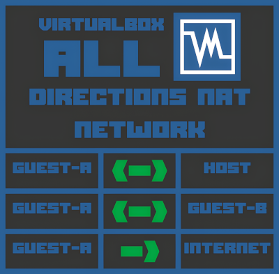

## VirtualBox - All Directions NAT Network



This is a complete guide to have the accesses "Guest-A <-> Host", "Guest-A <-> Guest-B" and "Guest-A -> Internet" on the guests **using a single network interface** ("host-only" network mode/"vboxnet0" host network interface) on VirtualBox.

In practice, what we will have is a NAT network with all accesses informed.

Run all the commands as "root".

**NOTE:** We use a Manjaro Linux (Arch Linux based) host as a template. You may need adjustments and changes to other distros.

**IMPORTANT:** My life, my work and my passion is free software. Corrections, tweaks and improvements are very welcome (**pull requests** 😉)! Please consider giving us a ⭐, fork, support this project or even visit our professional profile (see [About](#about)). **Thanks!** 🥰

## Donations

Please consider to deposit a donation through PayPal by clicking on the next button...

[](https://www.paypal.com/donate/?hosted_button_id=TANFQFHXMZDZE)

This is free software and you are equally free to specify any amount of money you want.

**Support free software and my work!** ❤️🐧

## Table of Contents

   * [EXECUTE ON HOST](#execute-on-host)
      + [Configure iptables](#configure-iptables)
      + [Configure IP forwarding](#configure-ip-forwarding)
      + [Install and configure dnsmasq](#install-and-configure-dnsmasq)
      + [PLUS: Configure "dnsmasq" as a DHCP](#plus-configure-dnsmasq-as-a-dhcp)
         - [Create dnsmasq-vboxnet0.service systemd service](#create-dnsmasq-vboxnet0service-systemd-service)
         - [Configure dnsmasq-vboxnet0.service systemd service](#configure-dnsmasq-vboxnet0service-systemd-service)
         - [Adjusting the AppArmor](#adjusting-the-apparmor)
         - [Create dnsmasq_check_vboxnet0.sh to check the vboxnet0 interface status](#create-dnsmasq_check_vboxnet0sh-to-check-the-vboxnet0-interface-status)
         - [Create the dnsmasq-check-vboxnet0.service systemd service](#create-the-dnsmasq-check-vboxnet0service-systemd-service)
         - [Create the dnsmasq-check-vboxnet0.timer systemd timer](#create-the-dnsmasq-check-vboxnet0timer-systemd-timer)
   * [EXTRA: EXECUTE ON GUEST](#extra-execute-on-guest)
- [About](#about)

## EXECUTE ON HOST

### Configure iptables

Copy the iptables template configuration file...

```
cp /etc/iptables/empty.rules /etc/iptables/iptables.rules
```

... so you can start the "iptables.service".

Enable and start "iptables.service"...

```
systemctl enable --now iptables.service
```

Add the following iptables rules. This will forward packets through the host ("vboxnet0" host network interface) and to the internet...

```
iptables -t nat -I POSTROUTING -s 192.168.56.0/24 -j MASQUERADE
iptables -P FORWARD ACCEPT
iptables -t nat -P POSTROUTING ACCEPT
```

**IMPORTANT:** The VirtualBox's "vboxnet0" host network interface should have IP (IPv4) "192.168.56.1" and subnet mask "255.255.255.0".

Save rules to iptables configuration and restart the service...

```
iptables-save > /etc/iptables/iptables.rules
systemctl restart iptables.service
```

### Configure IP forwarding

Enable IP forwarding...

```
sysctl -w net.ipv4.ip_forward=1
printf "net.ipv4.ip_forward=1\n" >> /etc/sysctl.d/30-ipforward.conf
```

### Install and configure dnsmasq

The "dnsmasq" is a small caching DNS proxy and DHCP/TFTP server.

Install "dnsmasq"...

```
pamac install --no-confirm dnsmasq
```

Enable and start "dnsmasq"...

```
systemctl enable --now dnsmasq.service
```

### PLUS: Configure "dnsmasq" as a DHCP

Since the DHCP available in VirtualBox's "host-only" ("vboxnet0" host network interface) network mode does not configure the DNS and Gateway settings to the Guests, we have to use "dnsmasq" as a DHCP.

The presented scheme will start the "dnsmasq" service whenever the "vboxnet0" interface appears and stop it when the interface disappears. It also allows a custom instance of "dnsmasq" service for the "vboxnet0" network interface to run separately from a standard "dnsmasq" service instance.

#### Create dnsmasq-vboxnet0.service systemd service

**TIP:** The code below is a set of BASH commands that creates the file "/etc/systemd/system/dnsmasq-vboxnet0.service". The content of the cited file is contained between the delimiters "BEGIN" and "END".

```
read -r -d '' FILE_CONTENT << 'HEREDOC'
BEGIN
[Unit]
Description=dnsmasq for vboxnet0 - A lightweight DHCP and DNS server for VirtualBox host-only network
Documentation=man:dnsmasq(8)
After=network.target
Before=network-online.target nss-lookup.target
Wants=nss-lookup.target

[Service]
Type=simple
ExecStartPre=/usr/bin/dnsmasq --test --conf-file=/etc/dnsmasq-vboxnet0.conf
ExecStart=/usr/bin/dnsmasq -k --user=dnsmasq --pid-file --conf-file=/etc/dnsmasq-vboxnet0.conf
ExecReload=/bin/kill -HUP $MAINPID
Restart=on-failure
PrivateDevices=true
ProtectSystem=full

[Install]
WantedBy=multi-user.target

END
HEREDOC
echo -n "${FILE_CONTENT:6:-3}" > "/etc/systemd/system/dnsmasq-vboxnet0.service"
```

#### Configure dnsmasq-vboxnet0.service systemd service

```
read -r -d '' FILE_CONTENT << 'HEREDOC'
BEGIN
# DHCP - VirtualBox Host-only Network
interface=vboxnet0
bind-interfaces
dhcp-range=192.168.56.10,192.168.56.100,12h  # DHCP range for the guests
dhcp-option=3,192.168.56.1  # Gateway option
dhcp-option=6,192.168.56.1  # DNS option

END
HEREDOC
echo -n "${FILE_CONTENT:6:-3}" > "/etc/dnsmasq-vboxnet0.conf"
```

#### Adjusting the AppArmor

If AppArmor is active (`sudo aa-status`), you will need to modify its profile to allow dnsmasq access to the custom configuration file.

To adjust the AppArmor profile for "dnsmasq" to allow it access to the new configuration file...

```
sed -i '/\/etc\/dnsmasq\.conf r,/i \  /etc/dnsmasq-vboxnet0.conf r,' /etc/apparmor.d/usr.sbin.dnsmasq
apparmor_parser -r /etc/apparmor.d/usr.sbin.dnsmasq
```

To reload the AppArmor profile to apply the new rules...

```
apparmor_parser -r /etc/apparmor.d/usr.sbin.dnsmasq
```

#### Create dnsmasq_check_vboxnet0.sh to check the vboxnet0 interface status

The script below checks if the "vboxnet0" interface is available and ready for the custom instance of "dnsmasq" service to bind to it.

```
read -r -d '' FILE_CONTENT << 'HEREDOC'
BEGIN
#!/bin/bash

if ip link show vboxnet0 | grep -q "state UP"; then
    systemctl start dnsmasq-vboxnet0.service
else
    systemctl stop dnsmasq-vboxnet0.service
fi

END
HEREDOC
echo -n "${FILE_CONTENT:6:-3}" > "/usr/local/bin/dnsmasq_check_vboxnet0.sh"
```

Make the script executable...

```
chmod +x /usr/local/bin/dnsmasq_check_vboxnet0.sh
```

#### Create the dnsmasq-check-vboxnet0.service systemd service

The service below just runs the "dnsmasq_check_vboxnet0.sh" script.

```
read -r -d '' FILE_CONTENT << 'HEREDOC'
BEGIN
[Unit]
Description=Check vboxnet0 interface state and start/stop dnsmasq

[Service]
Type=oneshot
ExecStart=/usr/local/bin/dnsmasq_check_vboxnet0.sh

END
HEREDOC
echo -n "${FILE_CONTENT:6:-3}" > "/etc/systemd/system/dnsmasq-check-vboxnet0.service"
```

#### Create the dnsmasq-check-vboxnet0.timer systemd timer

The "dnsmasq-check-vboxnet0.timer" systemd timer runs the "dnsmasq-check-vboxnet0.service" systemd service every 20 seconds ("OnUnitActiveSec"), starting after 30 seconds ("OnBootSec") of the OS boot.

```
read -r -d '' FILE_CONTENT << 'HEREDOC'
BEGIN
[Unit]
Description=Periodically check if vboxnet0 interface is up and start/stop dnsmasq

[Timer]
OnBootSec=30s
OnUnitActiveSec=20s

[Install]
WantedBy=timers.target

END
HEREDOC
echo -n "${FILE_CONTENT:6:-3}" > "/etc/systemd/system/dnsmasq-check-vboxnet0.timer"
```

Stop and disable "dnsmasq.service"...

```
systemctl disable --now dnsmasq.service
```

**NOTE:** As already informed, the configuration created allows the "dnsmasq-vboxnet0.service" service to run alongside the "dnsmasq.service" standard service. However, for practical reasons we are disabling the "dnsmasq.service" standard service.

**IMPORTANT:** Disable the VirtualBox's DHCP server for the "vboxnet0" host network interface.

Enable and start "dnsmasq-check-vboxnet0.timer"...

```
systemctl enable --now dnsmasq-check-vboxnet0.timer
```

## EXTRA: EXECUTE ON GUEST

**NOTE:** We use a CentOS 7 guest as a template. You may need adjustments and changes to other distros.

Configure the network interface according to the model...

**NOTE:** The network configuration file is in the "/etc/sysconfig/network-scripts/" folder path.

**MODEL**

```
BOOTPROTO=static
DEVICE=<NETWORK_INTERFACE_NAME>
DNS1=<HOST-ONLY_HOST_IP>
GATEWAY=<HOST-ONLY_HOST_IP>
IPADDR=<HOST-ONLY_GUEST_IP>
IPV6INIT=NO
NETMASK=255.255.255.0
NM_CONTROLLED=yes
ONBOOT=yes
TYPE=Ethernet
USERCTL=NO
ZONE=
```

**EXAMPLE**

```
BOOTPROTO=static
DEVICE=eno16777736
DNS1=192.168.56.1
GATEWAY=192.168.56.1
IPADDR=192.168.56.101
IPV6INIT=NO
NETMASK=255.255.255.0
NM_CONTROLLED=yes
ONBOOT=yes
TYPE=Ethernet
USERCTL=NO
ZONE=
```

Restart the network service...

```
systemctl restart network.service
```

To test...

```
curl http://www.google.com
```

# About

VirtualBox - All Directions NAT Network 🄯 BSD-3-Clause  
Eduardo Lúcio Amorim Costa  
Brazil-DF 🇧🇷  
https://www.linkedin.com/in/eduardo-software-livre/
